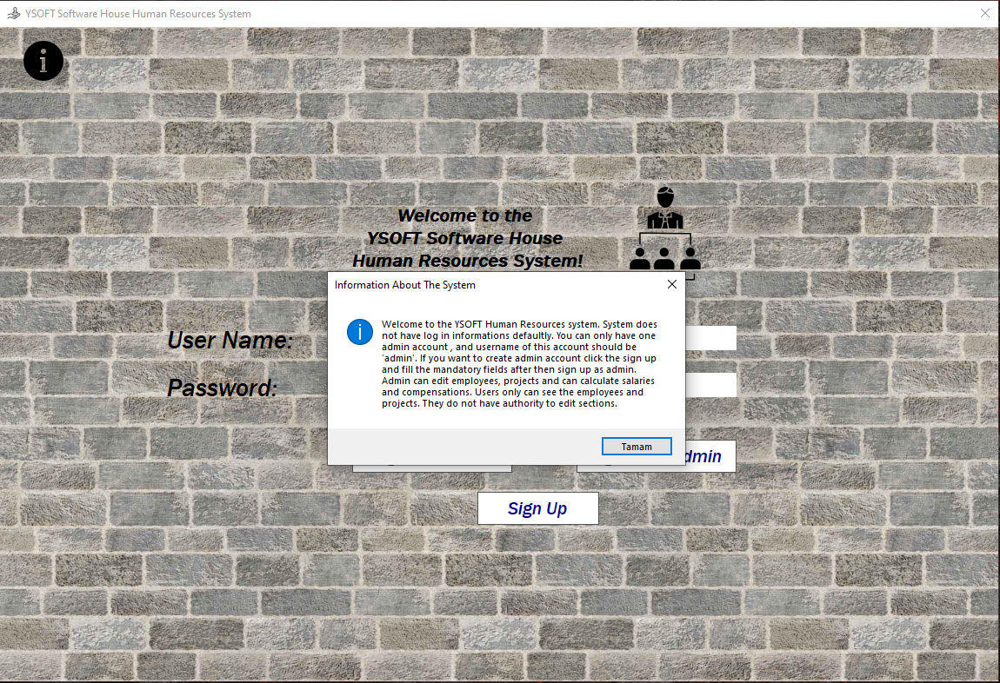
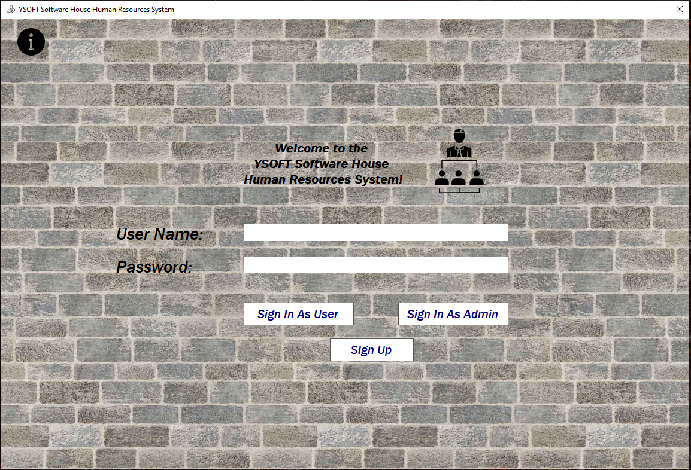
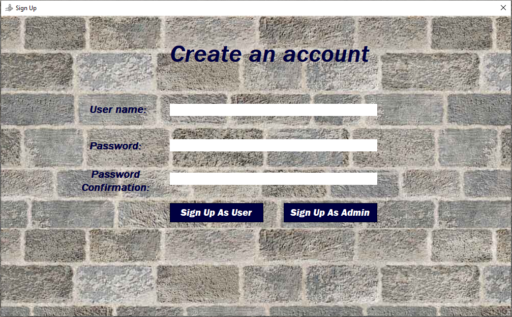
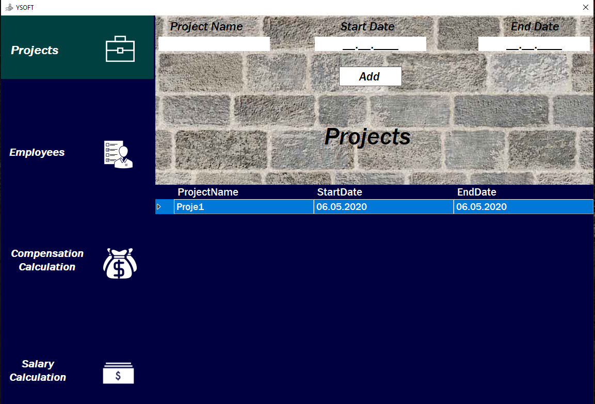
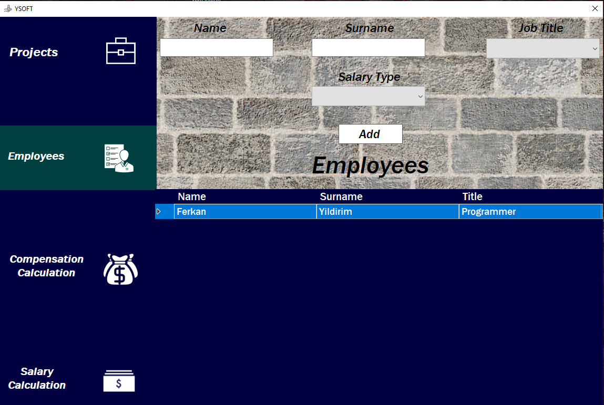
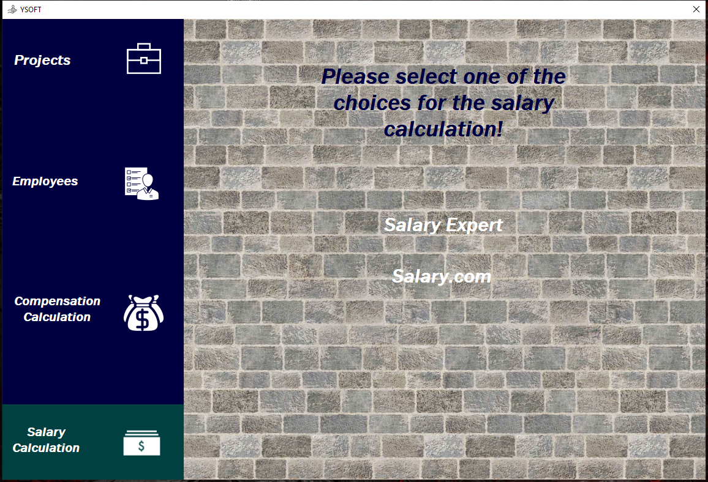
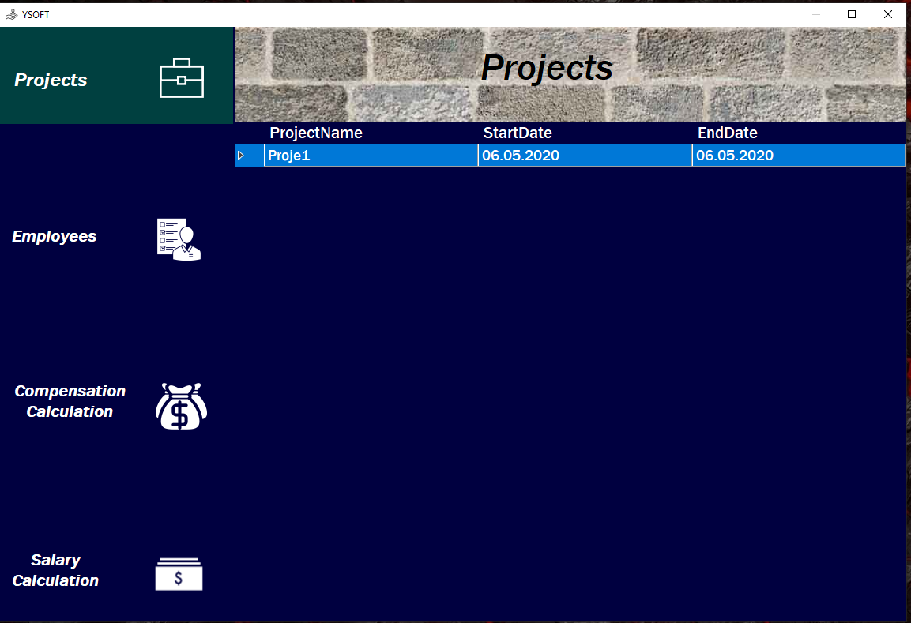
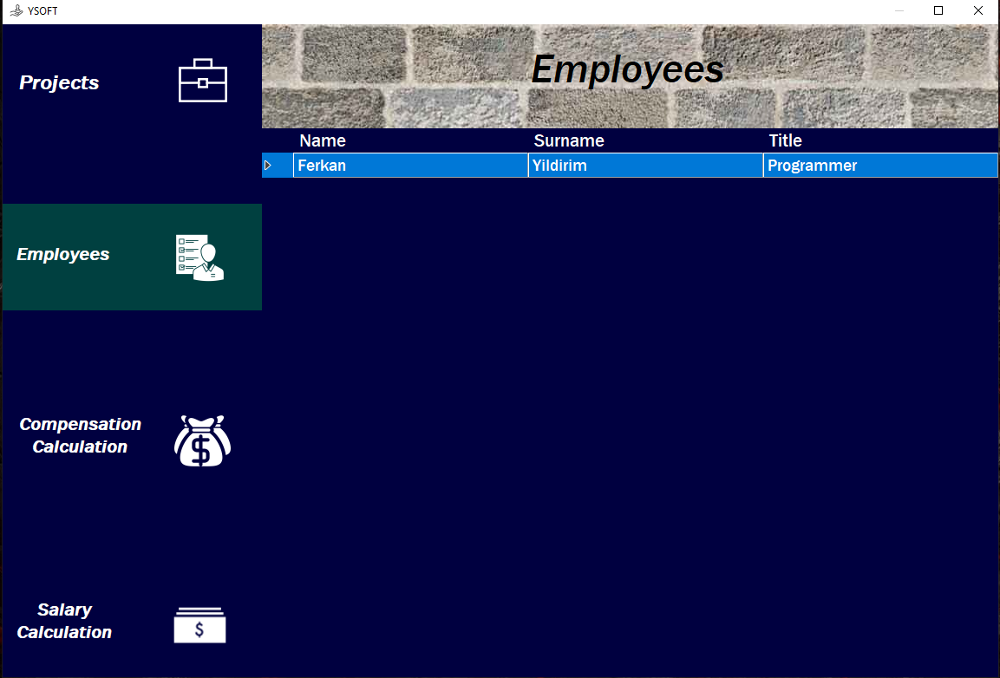
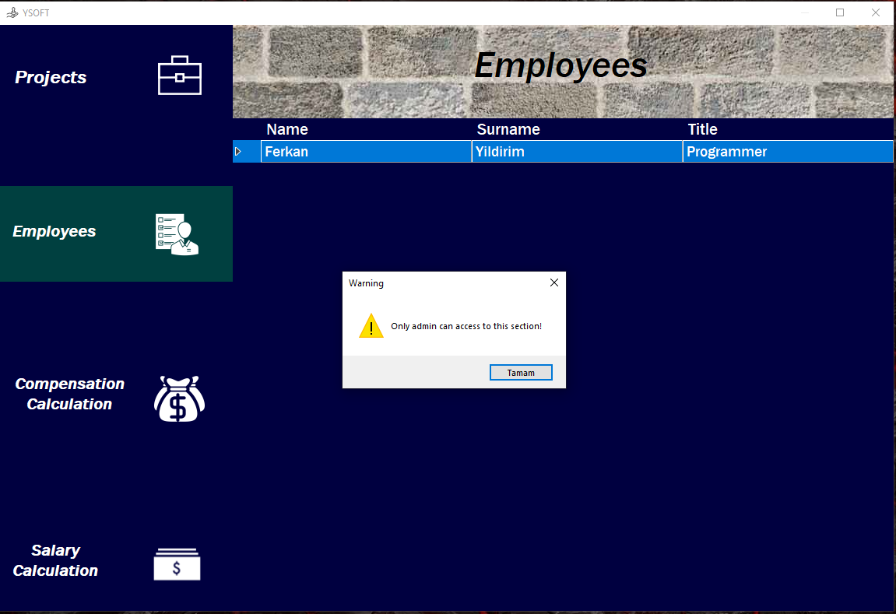

# Human-Resources-System
This project is developed for a software development lecture. System has log in and sign up operatings at the beginning. Log in can be done by user and admin. Admin can edit projects, employees and calculate salary and compensation. User can only see the project list and employee lists. System has reserved the admin keyword, so user can not use this name in sign up operations. System can only have one admin.Compensation and Salary are calculated by using web services.

